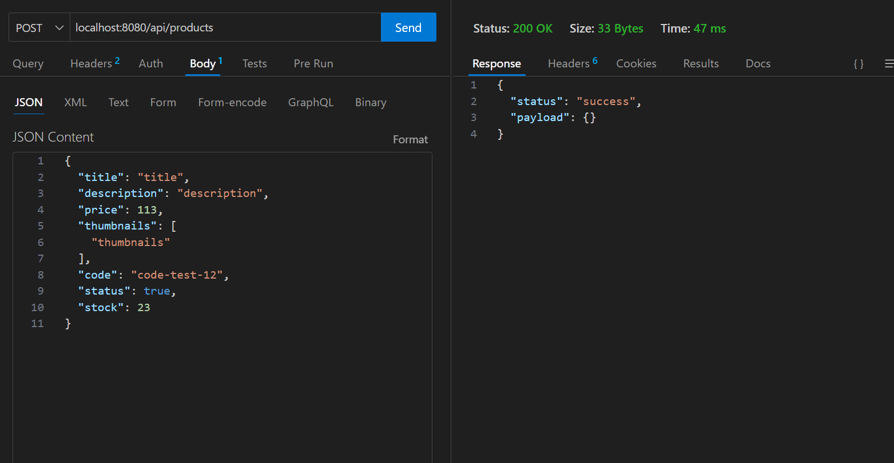

# coderNode

## user/

## user/register

## user/login

## user/login --> github

## api/products

### POST

### GET ALL

### GET BY ID

### PUT

## api/carts 

### POST

### GET BY ID

### PUT

## /realtimeproducts

## /chat

